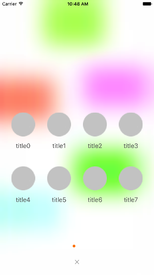

# SuspensionMenu
仿新浪微博的发布菜单，三行代码即可简单实现



Usage
=====

Adding the following to your `Podfile` and running `pod install` should do the trick:

```
pod 'SuspensionMenu'
```

*If you don't want to use CocoaPods*, you can use Carthage or grab the files located in the *Resources* and *Classes* folder and pull them into your project manually.


#### Swift
```Swift
        let titles = ["title0","title1","title2","title3","title4","title5","title6","title7","title8"]
        let imgs = ["默认图","默认图","默认图","默认图","默认图","默认图","默认图","默认图","默认图"]
        SuspensionMenu.ShowSuspensionMenuWith(titles: titles, imgNames: imgs) { (i) in
            print("点击了第"+"\(i)"+"个选项")
        }
```
